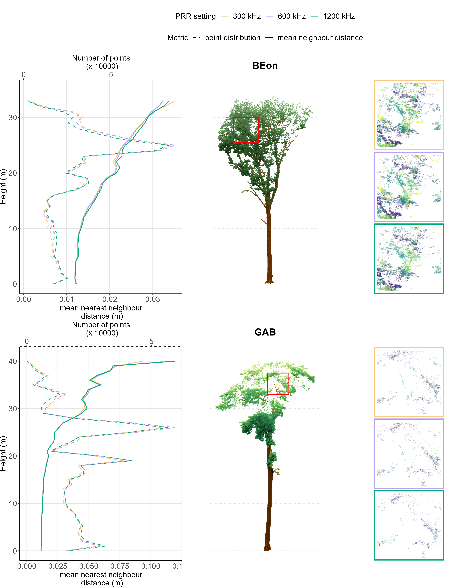
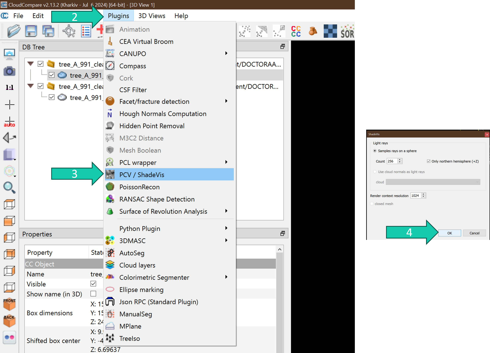
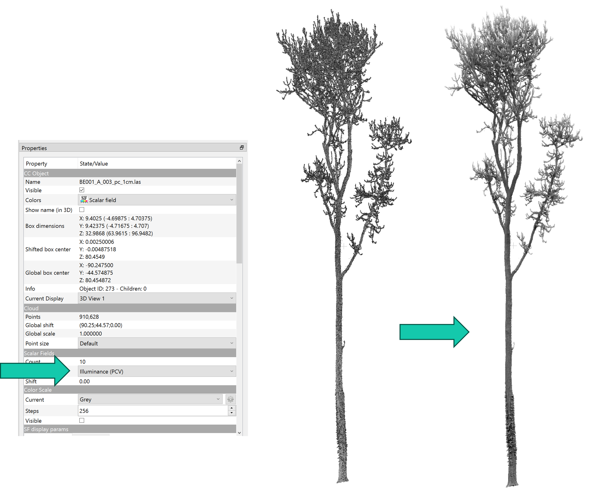
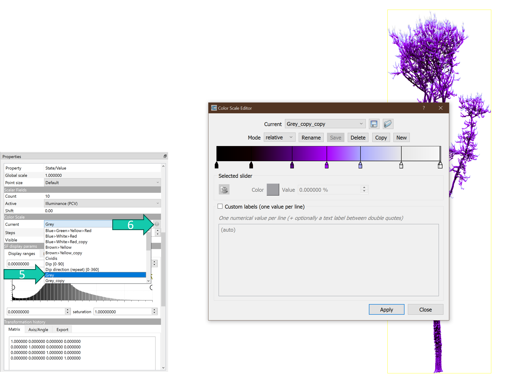
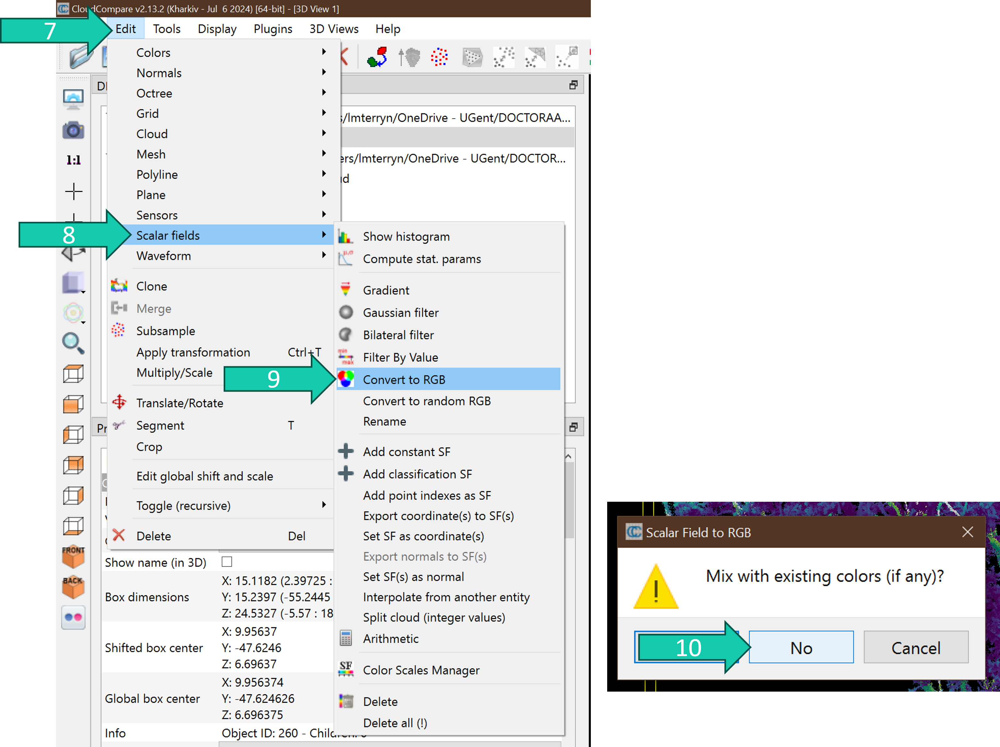
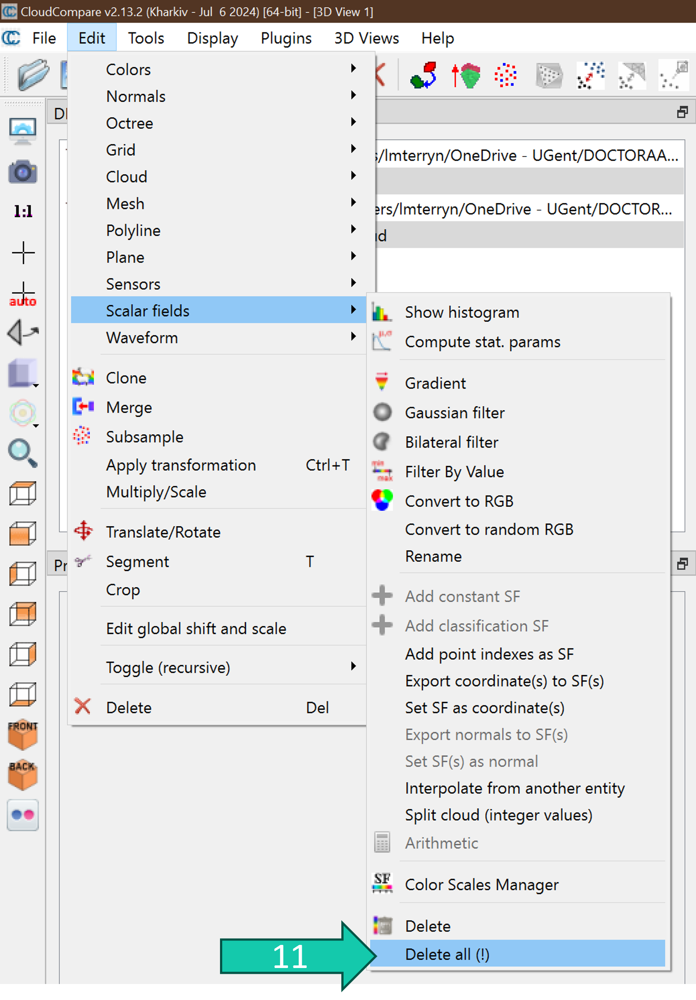
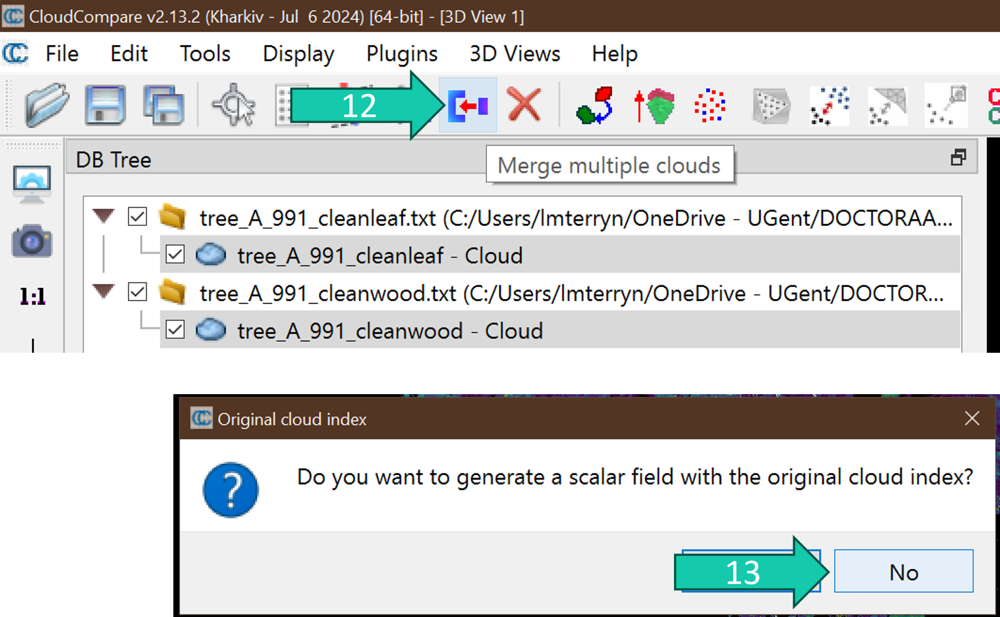
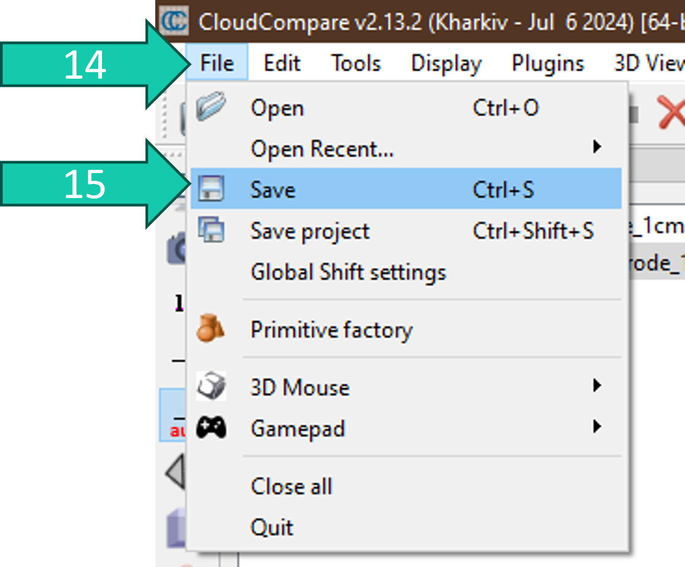

# Give color to your tree point cloud in CloudCompare

This is a manual to give nice colors to your tree point cloud using CloudCompare (CC). The colored tree point cloud can then be visualised in other softwares and platforms such as R, Python, Sketchfab etc. 

# Examples of figures with nicely colored tree point clouds
* Example using multi-temporal data:

* Example from using big trees:

* Examples from https://doi.org/10.3390/rs16234560:

# Steps
## Preparation
If you have a leaf-on point cloud it can be nice to color the leaves and the wood with different colors. To do this you first have to leaf-wood separate your point clouds. You can check out these manuals to do so: 

* https://github.com/qforestlab/leaf-wood-segmentation-with-GBSeparation
* https://github.com/qforestlab/leaf-wood-segmentation-with-deep-learning 

## Import and PCV/ShadeVis
First you need to import your point cloud(s) and perform the ShadeVis "filter". 

1. Import your point cloud(s) in CloudCompare with your preferred method (*File* > *Open* OR drag the file into CC).
2. Select your point cloud(s) and go to *Plugins*.
3. Click on *PCV/ShadeVis*.
4. Click on *OK*.

This adds a new scalar field *Illuminance (PCV)* to your point cloud(s):

## Color scale
Now you should choose a different color scale: 

5. You can change the color scale of this scalar field to a existing one (under *Color Scale* > *Current*) OR
6. You can make your own colorscale by clicking on the little gear symbol and playing around with the *Color Scale Editor* (GO CRAZY!).

You can export your color scales and import color scales from other people (see folder **color_scales** for some options.)

## Set RGB color
Now you should transfer the scolor scale(s) in the RGB field of the point cloud(s):

7. Select your point cloud(s) and go to *Edit*.
8. Go to *Scalar fields*.
9. Click on *Convert to RGB*.
10. Click *No*.

## Delete scalar fields
Now you can delete your scalar fields to have a smaller point cloud file after saving. This can be important when uploading it to platforms such as Sketchfab which have a maximum size requirement.

11. Do steps 7-8 and click on *Delete all (!)*.

## Optional merge
If you made a different coloring for the leaf and wood point cloud you could merge the two point clouds at this point:

12. Select the point clouds you want to merge and click on the *Merge multiple clouds* symbol. 
13. Click on *No*. 

## Save your point cloud
Save your point cloud to make figures of in other softwares such as R, Python, Sketchfab.

14. Select your point cloud and go to *File*. 
15. Click on *Save*.
16. Save the point cloud with your preferred settings.

# Make figures with these colored point clouds
In the folder **figure_code** you can find some examples of code to make figures using these point clouds.